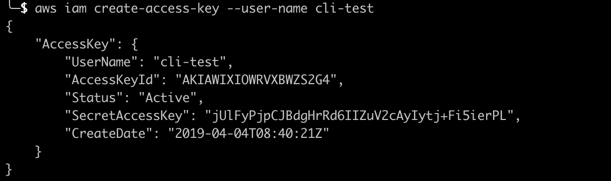
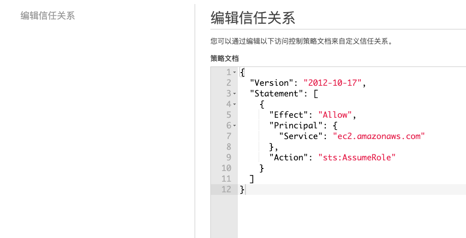
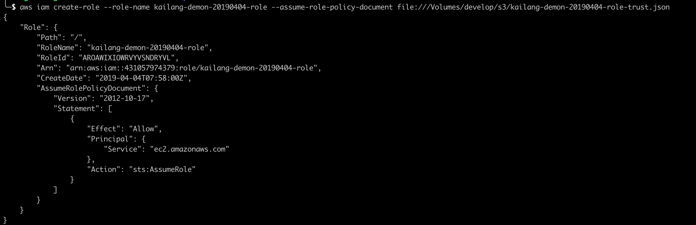
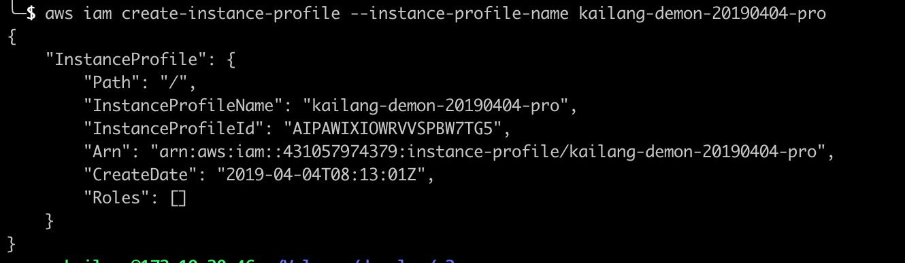

## 安装
使用 pip 安装 `AWS CLI`

```bash
curl -O https://bootstrap.pypa.io/get-pip.py
python3 get-pip.py --user
 
pip install awscli --upgrade --user
# 配置 aws，根据各自使用的终端选择配置
vim ~/.zshrc
# 添加别名
alias aws='/Users/wangkailang/Library/Python/3.7/bin/aws'
# 检查
aws --version
```

## 配置证书

使用 AWS CLI  命令时，需要在环境（Environment）中设置凭证， cli 命令会提前调用指定的凭证从而有权限调用。

在 AWS IAM 中创建用户 cli-test,本地执行命令



### Amazon EC2 使用 IAM 控制台创建配置文件
> 参考：https://docs.aws.amazon.com/zh_cn/cloud9/latest/user-guide//credentials.html#credentials-temporary-create-cli

1. 登陆到 IAM 控制台（建议使用管理员账户登陆）：https://console.aws.amazon.com/iam
2. 导航栏中选择 `Roles(角色)`
3. `AWS service(AWS 服务) => EC2`
4. 权限选择：`AdministratorAccess`
5. 输入角色名称 `kailang-demon-20190404`， 记录下名称，后面会用到
6. 进入创建角色的详情 => 信任关系，选择“编辑信任关系”，得到下面的“权限策略”

7. 配置命令
```bash
# 创建一个 IAM 角色
aws iam create-role --role-name kailang-demon-20190404-role --assume-role-policy-document file:///Volumes/develop/s3/kailang-demon-20190404-role-trust.json
# 将 AWS 访问权限附加到 IAM 角色
aws iam attach-role-policy --role-name kailang-demon-20190404-role --policy-arn arn:aws:iam::aws:policy/AdministratorAccess
# 指定新实例配置文件的名称 (如 kailang-demon-20190404-pro)
aws iam create-instance-profile --instance-profile-name kailang-demon-20190404-pro
# IAM 角色附加到实例配置文件
aws iam add-role-to-instance-profile --role-name kailang-demon-20190404-role --instance-profile-name kailang-demon-20190404-pro
```



## 参考
- [mac aws cli 安装](https://docs.aws.amazon.com/zh_cn/cli/latest/userguide/install-macos.html)