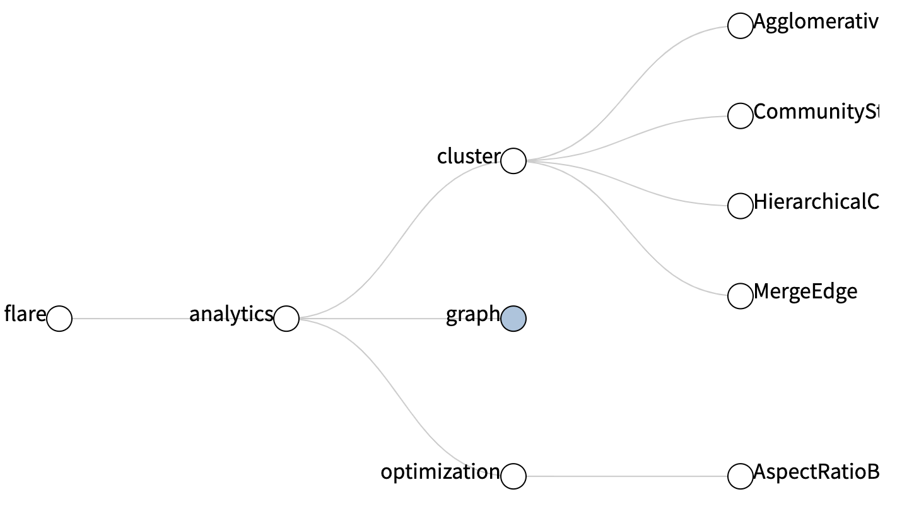
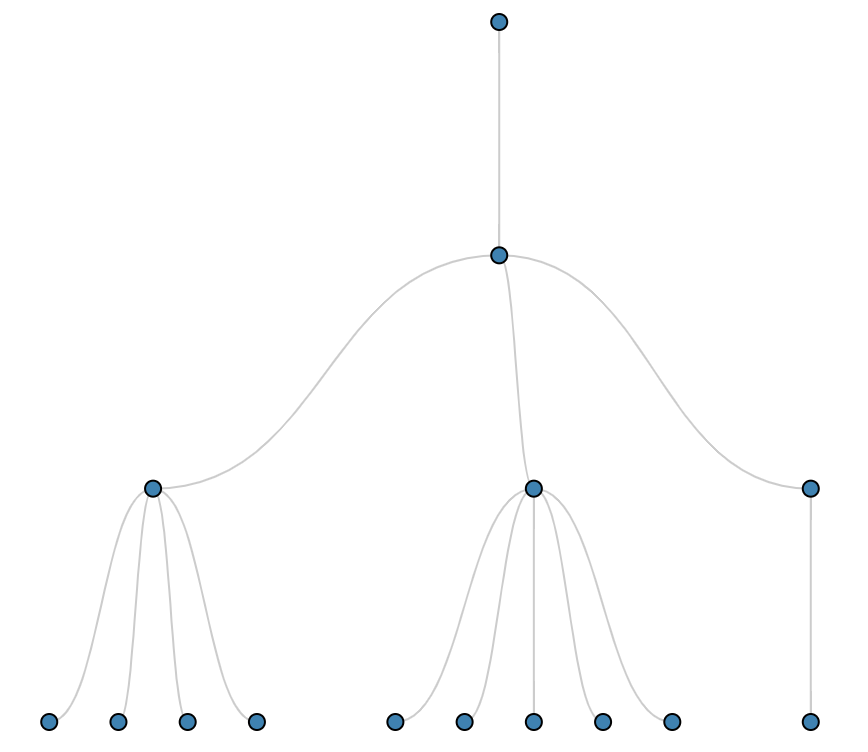
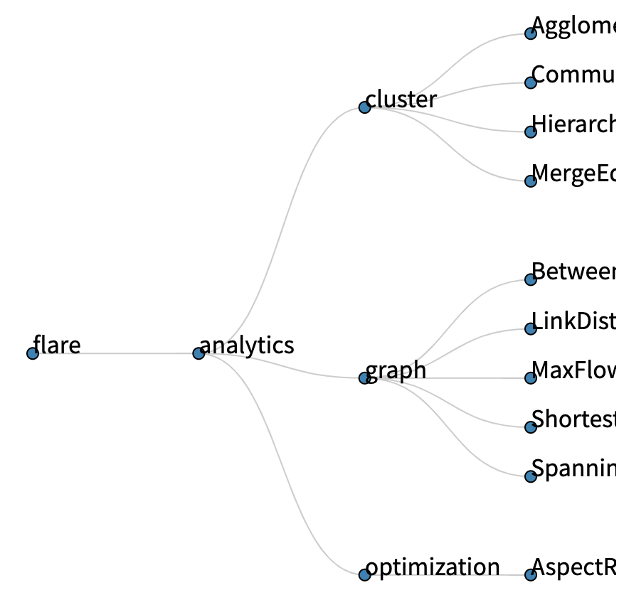

## 相关知识
### 工作原理
使用的是 D3 cluster layout 中的 API，对简单的数据进行格式化，补充父级、子级、坐标位置（Automatic Graph Drawing 算法）等可用数据。同时，提供快捷函数拿到需要数据进行渲染绘图。渲染后的数据结构如下：
```js
{
  children: Array, // 子级
  data: Object, // 自身数据
  depth: Number,
  height: Number,
  parent: Object, // 父级
  x: Number, // x 轴坐标
  y: Number, // y 轴坐标
}
```

### 使用函数
- d3.layout.cluster() 设置默认簇布局
- d3.layout.hierarchy() 默认设置创建新的分层布局
- root.descendants() 所有节点的数组
- root.links() 表达父子关系的数组

## 实现简单的簇布局
依赖 `d3-hierarchy`

```jsx run
<ClusterLayout/>
```

```jsx
import React from 'react';
import { hierarchy, cluster } from 'd3-hierarchy';
import data from './datas';
import './style.scss';

const width = 450;
const height = 500;

const clusterLayout = cluster().size([height - 50, width - 100]);
const root = hierarchy(data, function (d) {
  return d.children;
});
clusterLayout(root);

class ClusterLayout extends React.PureComponent {
  renderNodes = () => {
    return root.descendants().map((d, idx) => {
      return (
        <g
          className="node"
          key={`link_${idx}`}
        >
          <circle r="4" cx={d.x} cy={d.y}/>
        </g>
      )
    });
  }
  renderLinks = () => {
    return root.links().map((d, idx) => {
      return (
        <line
          className="link"
          key={`link_${idx}`}
          x1={d.source.x}
          y1={d.source.y}
          x2={d.target.x}
          y2={d.target.y}
        />
      )
    });
  }
  renderSvg = () => {
    return (
      <svg width={width} height={height}>
        <g transform="translate(0, 40)">
          <g className="links">
            {this.renderLinks()}
          </g>
          <g className="nodes">
            {this.renderNodes()}
          </g>
        </g>
      </svg>
    )
  }
  render() {
    return (
      <div className="Dendrogram">
        {this.renderSvg()}
      </div>
    )
  }
}

export default ClusterLayout;
```
## 绘制曲线



绘制曲线链接需要将 line 改为更加灵活的 path 进行绘图。改动细节：
```jsx
// 格式化
function formatPath(d) {
  const averageX = (d.source.x + d.target.x) / 2;
  return `M ${d.source.x}, ${d.source.y}
    C ${averageX}, ${d.source.y} ${averageX}, ${d.target.y} ${d.target.x}, ${d.target.y}`;
}
// 使用 path
renderLinks = () => {
  return root.links().map((d, idx) => {
    return (
      <path
        className="link"
        d={formatPath(d)}
        key={`link_${idx}`}
      />
    )
  });
}
```

## 横向排列并补充文案



1. 线条：要将 formatPath 函数的 x、y 对换
2. 节点：transform 翻转，同时去掉 circle 的 cx、cy 属性
```jsx
// 线条 x、y 轴对换
function formatPath(d) {
  const averageY = (d.source.y + d.target.y) / 2;
  return `M ${d.source.y}, ${d.source.x}
    C ${averageY}, ${d.source.x} ${averageY}, ${d.target.x} ${d.target.y}, ${d.target.x}`;
}
// 节点翻转
renderNodes = () => {
  return root.descendants().map((d, idx) => {
    return (
      <g
        transform={`translate(${d.y}, ${d.x})`}
        className="node"
        key={`link_${idx}`}
      >
        <circle r="4" />
        <text>{d.data.name}</text>
      </g>
    )
  });
}
```

## 实现收缩

```jsx run
CollapsibleTree
```

```jsx
import React from 'react';
import { hierarchy, cluster } from 'd3-hierarchy';
import { select } from 'd3-selection';
import datas from './datas';
import './style.scss'

// Set the dimensions and margins of the diagram
const width = 700;
const height = 500;
const diameter = 10;
const distance = 160;

// Collapse the node and all it's children
function collapse(d) {
  if (d.children) {
    d._children = d.children
    d._children.forEach(collapse)
    d.children = null
  }
}

// Creates a curved (diagonal) path from parent to the child nodes
function diagonal(s, d) {
  const averageY = (s.y + d.y) / 2;
  return `M ${s.y}, ${s.x}
    C ${averageY}, ${s.x} ${averageY}, ${d.x} ${d.y}, ${d.x}`;
}

const clusterLayout = cluster().size([height, width - 100]);
// Assigns parent, children, height, depth
const root = hierarchy(datas, function (d) { return d.children; });
root.x0 = height / 2;
root.y0 = 0;


class CollapsibleTree extends React.PureComponent {
  componentDidMount() {
    const svg = select('.CollapsibleTree svg g');
    let i = 0;

    // Collapse after the second level
    root.children.forEach(collapse);
    update(root);

    function update(source) {

      // Assigns the x and y position for the nodes
      const treeData = clusterLayout(root);

      // Compute the new tree layout.
      const nodes = treeData.descendants();
      const links = treeData.descendants().slice(1);

      nodes.forEach(function (d) { d.y = d.depth * distance });

      // Update the nodes...
      const node = svg.selectAll('g.node')
        .data(nodes, function (d) { return d.id || (d.id = ++i); });

      // Enter any new modes at the parent's previous position.
      const nodeEnter = node.enter().append('g')
        .attr('class', 'node')
        .attr("transform", function (d) {
          return "translate(" + source.y0 + "," + source.x0 + ")";
        })
        .on('click', click);

      // Add Circle for the nodes
      nodeEnter.append('circle')
        .attr('class', 'node')
        .attr('r', diameter)
        .style("fill", function (d) {
          return d._children ? "lightsteelblue" : "#fff";
        });

      // Add labels for the nodes
      nodeEnter.append('text')
        .attr("dy", 2)
        .attr("x", function (d) {
          return d.children || d._children ? -diameter : diameter;
        })
        .attr("text-anchor", function (d) {
          return d.children || d._children ? "end" : "start";
        })
        .text(function (d) { return d.data.name; });

      // UPDATE
      const nodeUpdate = nodeEnter.merge(node);

      // Transition to the proper position for the node
      nodeUpdate
        .attr("transform", function (d) {
          return "translate(" + d.y + "," + d.x + ")";
        });

      // Update the node attributes and style
      nodeUpdate.select('circle.node')
        .attr('r', 10)
        .style("fill", function (d) {
          return d._children ? "lightsteelblue" : "#fff";
        })
        .attr('cursor', 'pointer');


      // Remove any exiting nodes
     node.exit()
        .attr("transform", function (d) {
          return "translate(" + source.y + "," + source.x + ")";
        })
        .remove();

      // Update the links...
      const link = svg.selectAll('path.link')
        .data(links, function (d) { return d.id; });

      // Enter any new links at the parent's previous position.
      const linkEnter = link.enter().insert('path', "g")
        .attr("class", "link")
        .attr('d', function (d) {
          const o = { x: source.x0, y: source.y0 }
          return diagonal(o, o)
        });

      // UPDATE
      const linkUpdate = linkEnter.merge(link);

      // Transition back to the parent element position
      linkUpdate
        .attr('d', function (d) { return diagonal(d, d.parent) });

      // Remove any exiting links
      link.exit()
        .attr('d', function (d) {
          const o = { x: source.x, y: source.y }
          return diagonal(o, o)
        })
        .remove();

      // Store the old positions for transition.
      nodes.forEach(function (d) {
        d.x0 = d.x;
        d.y0 = d.y;
      });

      // Toggle children on click.
      function click(d) {
        if (d.children) {
          d._children = d.children;
          d.children = null;
        } else {
          d.children = d._children;
          d._children = null;
        }
        update(d);
      }
    }
  }
  render() {
    return (
      <div className="CollapsibleTree">
        <svg width={width} height={height}>
          <g transform="translate(50, 0)"/>
        </svg>
      </div>
    )
  }
}

export default CollapsibleTree;
```

## 参考
- Automatic Graph Drawing 算法： [tidier-drawings](https://reingold.co/tidier-drawings.pdf), [buchheim improving](http://dirk.jivas.de/papers/buchheim02improving.pdf)
- [D3 Wiki 簇布局](https://github.com/d3/d3/wiki/%E7%B0%87%E5%B8%83%E5%B1%80)
- 实践：[dendrogram_basic](https://www.d3-graph-gallery.com/graph/dendrogram_basic.html)
- [d3-hierarchy](https://github.com/d3/d3-hierarchy)
- [d3-selection](https://github.com/d3/d3-selection)


