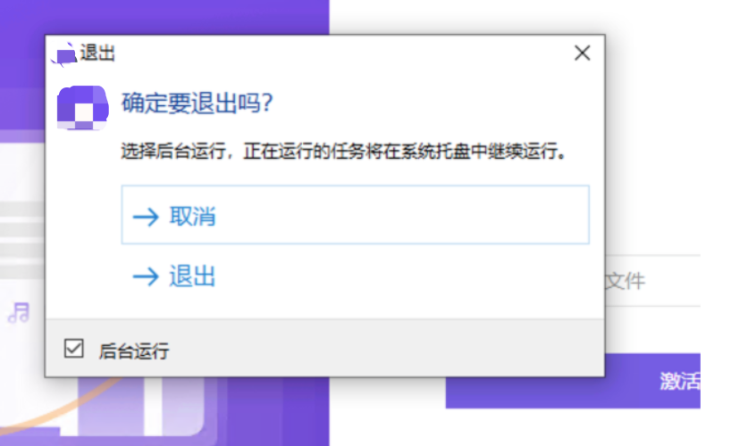
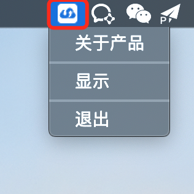

Electron 应用在执行一些长时间任务（比如上传、下载），我们想关闭界面后任务依旧执行。再次打开界面，依旧可以看到正在执行的任务以及任务进度。[托盘](https://www.electronjs.org/docs/api/tray)可以帮我们实现这个功能。

## 创建托盘和菜单示例

- 实例化 `Tray` 并传入图标路径；
- 创建菜单并配置到托盘中。

```js
const { app, Menu, Tray } = require('electron')

let tray = null;
// 等同 app.on('read', () => { ... })
app.whenReady().then(() => {
  tray = new Tray('/path/to/my/icon')
  const contextMenu = Menu.buildFromTemplate([
    { label: 'Item1', type: 'radio' },
    { label: 'Item2', type: 'radio' },
    { label: 'Item3', type: 'radio', checked: true },
    { label: 'Item4', type: 'radio' }
  ])
  tray.setContextMenu(contextMenu)
})

```

## 基于托盘功能实现后台运行应用

### 关闭应用前唤醒对话框二次确认

关闭应用时，触发对话框，可支持 3 种场景：

- 点击「取消」取消关闭操作；
- 点击「退出」，「后台运行」选中时，界面关闭，托盘不关闭，任务继续执行；
- 点击「退出」，「后台运行」不选中，界面、托盘关闭，直接退出，任务终止。

```
mainWindow.on('close', (e) => {
  dialog.showMessageBox({
      title: '退出',
      type: 'warning',
      icon: nativeImage.createFromPath(path.resolve(__dirname, 'icon.png')),
      message: `确定要退出吗？`,
      detail: '选择后台运行，正在运行的任务将在系统托盘中继续运行。',
      checkboxLabel: '后台运行',
      checkboxChecked: true,
      buttons: btns,
      defaultId: process.platform == 'darwin' ? 0 : 1,
    }).then(dm => {
        if (process.platform == 'darwin') {
          switch (dm.response) {
            case 0:
              dm.response = 1;
              break;
            case 1:
              dm.response = 0;
              break;
            default:
              dm.response = 1;
            }
        }
  
        switch (dm.response) {
          case 1:
            if (dm.checkboxChecked) {
              if (mainWindow.isVisible()) {
                // 修复全屏 hide 黑屏问题
                // https://github.com/electron/electron/issues/20263
                if (mainWindow.isFullScreen()) {
                  mainWindow.once('leave-full-screen', () => mainWindow.hide());
                  mainWindow.setFullScreen(false);
                } else {
                  mainWindow.hide();
                }
                e.preventDefault();
              }
            } else {
              app.exit(0);
            }
            break;
          default:
            e.preventDefault();
        }
      })
  e.preventDefault();
});
```

效果如下：




### 创建托盘并添加菜单操作

- 禁用双击（MacOS 系统不支持双击操作）
- 菜单栏支持操作：关于产品、显示、退出
- MacOS 默认是左单击打开菜单栏、Windows 是右单击打开菜单栏
- Windows 左单击显示界面

```js
let tray = null;
const createTray = () => {
    const trayIco = nativeImage.createFromPath(path.resolve(__dirname, 'tray_light.png'));
    tray = new Tray(trayIco);
    tray.setIgnoreDoubleClickEvents(true);
    if (process.platform !== 'darwin') {
      tray.on('click', () => {
        if (!mainWindow.isVisible()) {
          mainWindow.show();
        }
      });
    }
    const contextMenu = Menu.buildFromTemplate([
      {
        label: '关于产品',
        role: 'about',
      },
      { type: 'separator' },
      { 
        label: '显示',
        click: () => {
          if (!mainWindow.isVisible()) {
            mainWindow.show();
          }
        }
      },
      { type: 'separator' },
      {
        label: '退出',
        click: e => {
          if (!mainWindow.isVisible()) {
            mainWindow.show();
          }
          confirmForWorkers(e);
        },
      },
    ]);
    tray.setContextMenu(contextMenu);
  }

  createTray();
```

### 根据操作系统类型和系统 Mode 定制托盘图标

MacOS 支持 light、dark 两种 mode，根据 mode 展示不同的图标：




- `nativeTheme.shouldUseDarkColors` 可以判断系统 mode

```js
  const getTrayIcon = () => path.resolve(__dirname, process.platform !== 'darwin' ? 'tray_win.png' : nativeTheme.shouldUseDarkColors ? 'tray_dark.png' : 'tray_light.png');
```

### 切换系统 Mode 定制托盘图标改变


- `nativeTheme` 提供 `update` 监听系统本身的 Mode 变化

```js
 // refresh icon when MacOS dark/light theme has changed
  nativeTheme.on('updated', () => tray && tray.setImage(getTrayIcon()));
```

### 托盘其他场景

- 显示未读消息数 `tray.setTitle('6')`;
- 有未读消息时图标闪动：通过 `setImage` 定时轮询切换图标实现

## 注意事项
- `MacOS` 全屏退出界面是会出现黑屏问题，解决方案

判断如果全屏，在关闭全屏时，先退出全屏再隐藏界面

```js
// 修复全屏 hide 黑屏问题
// https://github.com/electron/electron/issues/20263
if (mainWindow.isFullScreen()) {
  mainWindow.once('leave-full-screen', () => mainWindow.hide());
  mainWindow.setFullScreen(false);
} else {
  mainWindow.hide();
}
```

- `Windows` 下面点击关闭出现二次确认框，但是界面马上关闭

需要阻止事件流，在 `close` 时阻止就可以

```js
mainWindow.on('close', (e) => {
  ...
  e.preventDefault();
})

```
