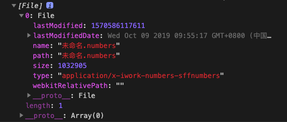
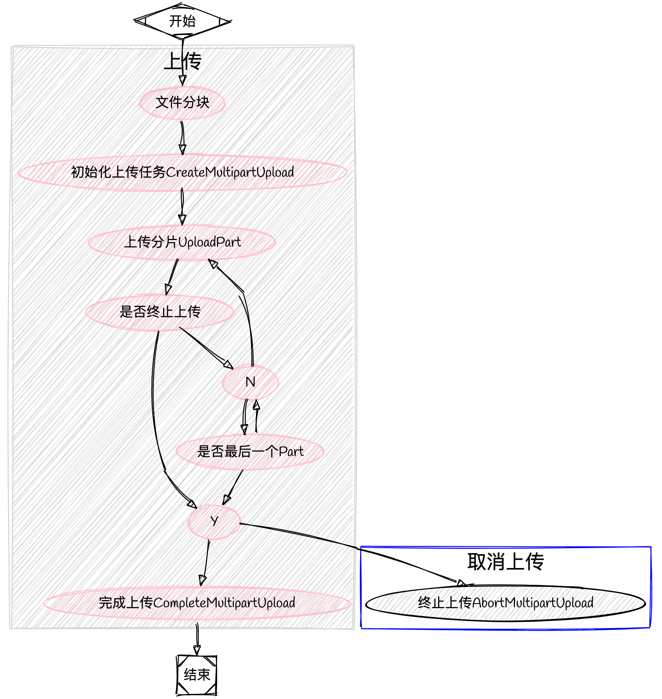

## 文件介绍

### HTML File Input

`<input type='file' />` 是 HTML 原生支持的上传标签，同时还用属性：
- `multiple` 支持一次上传多个文件
- `accept` 限制上传文件的类型

```html
<input
  type='file'
  id='file-uploader'
  data-target='file-uploader'
  accept='image/*'
  multiple='multiple'
/>
```
### 获取上传文件信息

- `fileInput.files` 返回 Blob 对象数组

```javascript
const fileUploader = document.querySelector('#file-uploader');

fileUploader.addEventListener('change', (e) => {
console.log(e.target.files[0]); // get file object
});
```

上传一个文件，这里使用 `e.target.files[0]` 拿到文件的内容，是 File Object, 文件 File 对象是 Blob 对象的子类。 可以在这里拿到文件 `name`，`size`， `type` 等信息。




## 文件上传

### 表单上传

- `FormData()`

将上传文件 `append` 到 `FormData()` 上并上传：

```javascript
let form = new FormData();
form.append("excel_file", e.target.files[i]);
// 上传
fetch('https://api.endpoint.com', {
	method: 'POST',
	body: form,
})
```

### json 上传

- 监听文件上传： `<input type='file' onChange={handleUpload} />`
- 获取上传文件 Blob： `e.target.files`
- 转成 `ArrayBuffer`：通过 `FileReader()` 转成 `ArrayBuffer` 格式
- 转成 `Uint8Array`
- 转成阵列： 通过 `Array.from()` 把 `Uint8Array` 格式数据转成阵列
- 转成 JSON 格式：直接对 `Uint8Array` 执行 `JSON.stringify()` 会报错，要使用 `Array.from()` 后才可以

> `new Uint8Array()` 转换出來是类阵列（Typed Array），可以通过 `Array.from()` 等方式转成真正的阵列。

```typescript
export const fileToArrayBuffer = (file: File | Blob): Promise<Uint8Array> => {
  return new Promise((resolve) => {
    let reader = new FileReader();
    reader.onload = async () => {
      resolve(new Uint8Array(reader.result as ArrayBuffer));
    };
    reader.readAsArrayBuffer(file);
  });
}
```

## 图片预览

### FileReader 实现

```javascript
const curFile = curFiles[0]
const reader = new FileReader();
reader.onload = function (e) {
  console.log('file:', e.target.result);
};

// 使用 readAsDataURL 将图片转成 Base64
reader.readAsDataURL(curFile);
```

### CreateObjectURL 实现

```javascript
const curFile = curFiles[0];
const objectURL = URL.createObjectURL(curFile);
console.log('objectURL', objectURL);
```


## 大文件上传

- [js-md5](https://github.com/emn178/js-md5) 支持直接将  `ArrayBuffer` 转成 md5

```typescript
import md5 from 'js-md5';
export const MB5 = 10 * 1024 * 1024;
export const fileParts = async (file: File, piece = MB5) => {
  const size = file.size;
  const times = Math.ceil(size / MB5);
  const parts = [];
  for(let i = 0; i < times; i++) {
    const currentLen = i * MB5;
    //文件 File 对象是 Blob 对象的子类，Blob 对象包含一个重要的方法slice，通过这个方法，就可以对二进制文件进行拆分。
    const currentBody = (i === times - 1) ? file.slice(currentLen) : file.slice(currentLen, currentLen + MB5);
    const curArrBufferPart = await fileToArrayBuffer(currentBody);
    const currentMd5 = md5(curArrBufferPart);
    parts.push({
      partNumber: i + 1,
      eTag: currentMd5,
      body: curArrBufferPart,
      size: currentBody.size,
    });
  }
  return parts
}
```



## 参考
- [Github MyS3Browser Upload Modal](https://github.com/shishirsharma/MyS3Browser/blob/c3461cb672e14c0a8e52dd9abd65e1f6981a7a47/src/app/upload-modal/upload-modal.component.ts)
- [那些沒告訴你的小細節](https://pjchender.blogspot.com/2019/01/js-javascript-input-file-upload-file.html)
- [阿里云-文件上传](https://help.aliyun.com/document_detail/31886.html)
- [Ant Design Upload 上传](https://ant.design/components/upload-cn/)
- [前端大文件上传](https://juejin.im/post/5cf765275188257c6b51775f)

