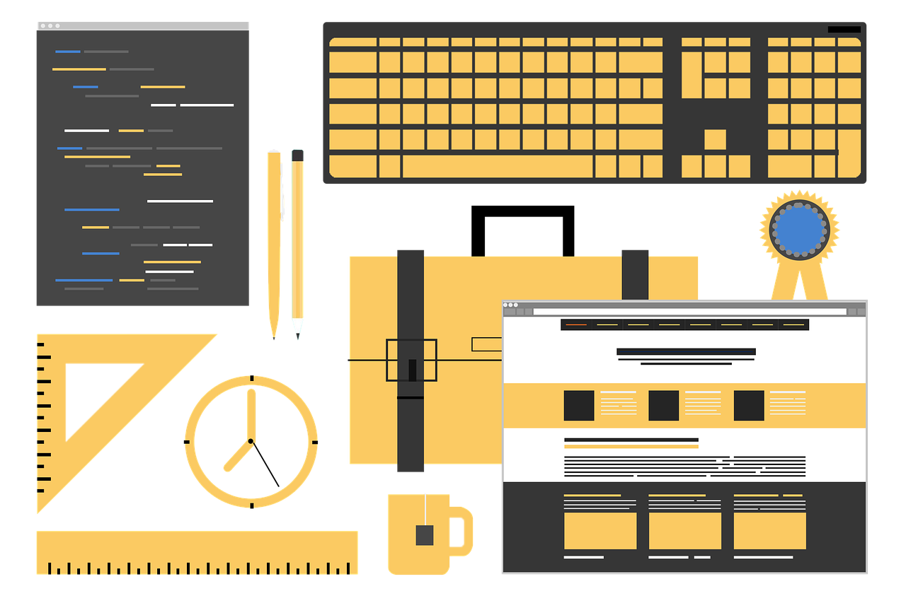

## 容器属性
有 6 个属性设置在容器上

- flex-direction => row | row-reverse | column | column-reverse
- flex-wrap 是否换行 => nowrap | wrap | wrap-reverse
- flex-flow

flex-flow 属性是 flex-direction 属性和 flex-wrap 属性的简写形式，默认值为 row nowrap。

- justify-content 水平对齐方式 => flex-start | flex-end | center | space-between | space-around
- align-items 垂直对齐方式 => flex-start | flex-end | center | baseline | stretch
- align-content 多根轴线的对齐方式 => flex-start | flex-end | center | space-between | space-around | stretch

## 项目属性
有 6 个

- order 定义项目的排列顺序。数值越小，排列越靠前，默认为 0；
- flex-grow 放大比例，默认为0，即如果存在剩余空间，也不放大；
- flex-shrink 缩小比例，默认为1，即如果空间不足，该项目将缩小；
- flex-basis 项目占据的主轴空间；
- flex flex 属性是 flex-grow, flex-shrink 和 flex-basis 的简写，默认值为 0 1 auto；
- align-self 项目有与其他项目不一样的对齐方式。

## 实时调试

### flex-grow、flex-shrink

```jsx run
() => {
  const [width, setWidth] = React.useState('100px');
  const containerStyle = {
    display: 'flex',
  };
  const itemStyle = { width };
  const btns = [
    { w: '100px', t: '放大填充' },
    { w: '450px', t: '缩小适配' },
  ]
  return (
    <>
      <div className="container" style={containerStyle}>
        <div className="item" style={{ ...itemStyle, flexShrink: 3 }}>1</div>
        <div className="item" style={{ ...itemStyle, flexGrow: 2 }}>2</div>
        <div className="item" style={itemStyle}>3</div>
      </div>
      {btns.map(item => (
        <button className={`margin4 pure-button${width === item.w ? ' pure-button-primary' : ''}`} onClick={() => setWidth(item.w)} key={item.w}>
          {item.t}
        </button>
      ))}
    </>
  )
}
```

### flex-wrap

```jsx run
() => {
  const [fw, setFw] = React.useState('nowrap');
  const containerStyle = {
    display: 'flex',
    flexWrap: fw
  };
  const itemStyle = {
    width: '300px',
  };
  return (
    <>
      <div className="container" style={containerStyle}>
        <div className="item" style={itemStyle}>1</div>
        <div className="item" style={itemStyle}>2</div>
        <div className="item" style={itemStyle}>3</div>
        <div className="item" style={itemStyle}>4</div>
        <div className="item" style={itemStyle}>5</div>
      </div>
      <div>
        {['nowrap', 'wrap', 'wrap-reverse'].map(item => (
          <button className={`margin4 pure-button${fw === item ? ' pure-button-primary' : ''}`} onClick={() => setFw(item)} key={item}>
            {item}
          </button>
        ))}
      </div>
    </>
  )
}
```

### flex-direction

```jsx run
() => {
  const [direction, setDirection] = React.useState('row');
  const containerStyle = {
    display: 'flex',
    flexDirection: direction
  };
  const itemStyle = {
    flex: 'auto',
  };
  return (
    <>
      <div className="container" style={containerStyle}>
        <div className="item" style={itemStyle}>1</div>
        <div className="item" style={itemStyle}>2</div>
        <div className="item" style={itemStyle}>3</div>
      </div>
      <div>
        {['row', 'row-reverse', 'column', 'column-reverse'].map(item => (
          <button className={`margin4 pure-button${direction === item ? ' pure-button-primary' : ''}`} onClick={() => setDirection(item)} key={item}>
            {item}
          </button>
        ))}
      </div>
    </>
  )
}
```

### align-items、align-self

```jsx run
() => {
  const [pSelf, setPSelf] = React.useState('center');
  const [self, setSelf] = React.useState('auto');
  const containerStyle = {
    display: 'flex',
    alignItems: pSelf,
    height: '100px'
  };
  const itemStyle = {
    width: '300px',
  };
  return (
    <>
      <div className="container" style={containerStyle}>
        <div className="item" style={itemStyle}>1</div>
        <div className="item" style={itemStyle}>2</div>
        <div className="item" style={itemStyle}>3</div>
        <div className="item" style={{ ...itemStyle, alignSelf: self }}>4</div>
        <div className="item" style={itemStyle}>5</div>
      </div>
      <p>
        <b>父元素 align-items：</b>
        {['auto', 'flex-start', 'flex-end', 'center', 'baseline', 'stretch'].map(item => (
          <button className={`margin4 pure-button${pSelf === item ? ' pure-button-primary' : ''}`} onClick={() => setPSelf(item)} key={`p-${item}`}>
            {item}
          </button>
        ))}
      </p>
      <p>
        <b>子元素 align-self：</b>
        {['auto', 'flex-start', 'flex-end', 'center', 'baseline', 'stretch'].map(item => (
          <button className={`margin4 pure-button${self === item ? ' pure-button-primary' : ''}`} onClick={() => setSelf(item)} key={item}>
            {item}
          </button>
        ))}
      </p>
    </>
  )
}
```

### align-content

```jsx run
() => {
  const [ac, setAc] = React.useState('flex-start');
  const containerStyle = {
    display: 'flex',
    flexWrap: 'wrap',
    height: '200px',
    justifyContent: ac
  };
  const itemStyle = {
    width: '300px',
    height: '35px'
  };
  return (
    <>
      <div className="container" style={containerStyle}>
        <div className="item" style={itemStyle}>1</div>
        <div className="item" style={itemStyle}>2</div>
        <div className="item" style={itemStyle}>3</div>
        <div className="item" style={itemStyle}>4</div>
        <div className="item" style={itemStyle}>5</div>
      </div>
      <div>
        {['normal', 'flex-start', 'flex-end', 'center', 'space-between', 'space-around', 'space-evenly', 'stretch'].map(item => (
          <button className={`margin4 pure-button${ac === item ? ' pure-button-primary' : ''}`} onClick={() => setAc(item)} key={item}>
            {item}
          </button>
        ))}
      </div>
    </>
  )
}
```


### justify-content

```jsx run
() => {
  const [jc, setJc] = React.useState('flex-start');
  const containerStyle = {
    display: 'flex',
    justifyContent: jc
  };
  const itemStyle = {
    width: '100px'
  };
  return (
    <>
      <div className="container" style={containerStyle}>
        <div className="item" style={itemStyle}>1</div>
        <div className="item" style={itemStyle}>2</div>
        <div className="item" style={itemStyle}>3</div>
      </div>
      <div>
        {['flex-start', 'flex-end', 'center', 'space-between', 'space-around', 'space-evenly'].map(item => (
          <button className={`margin4 pure-button${jc === item ? ' pure-button-primary' : ''}`} onClick={() => setJc(item)} key={item}>
            {item}
          </button>
        ))}
      </div>
    </>
  )
}
```


## 文档
- https://www.w3.org/TR/css-flexbox-1/
- https://css-tricks.com/snippets/css/a-guide-to-flexbox/#flexbox-background
- https://juejin.im/post/5940bcef61ff4b006cb6b0d5