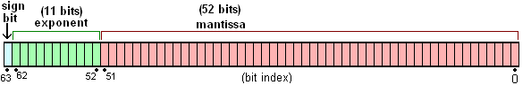

Javascript 中的数字按照 IEEE754 标准，使用 64 位双精度（double）浮点型来表示（统一处理整数和小数，节省存储空间）。[ES5规范](https://es5.github.io/#x8.5):
- `S` 1位符号位（Sign），为 +1 或 -1；
- `E` 11位指数位（Exponent）， 范围 [-1074, 971], 包括两端值；
- `M` 52位尾数位（Mantissa），正整数并且小于 2^53。



## 数值表示
```
s × m × 2^e
```

## 大数精度

```Javascript
// 上限  S 为 1 个 0，E 为 11 个 0，S 为 53 个 1
Math.pow(2, 53) - 1 === Number.MAX_SAFE_INTEGER; // true
// 下限  S 为 1 个 1，E 为 11 个 0，S 为 53 个 1
1 - Math.pow(2, 53) === Number.MIN_SAFE_INTEGER; // true
// 最大数，S 为 1 个 0，E 为 971，S 为 53个 1
(Math.pow(2, 53) - 1) * Math.pow(2, 971) === Number.MAX_VALUE; // true
// 最接近于0的正数，S 为 1 个 0，E 为 -1074，S 为 0
Math.pow(2, -1074) === Number.MIN_VALUE; // true
```

### 总结

[MIN_SAFE_INTEGER, MAX_SAFE_INTEGER] 范围的整数可以精确展示，超出则会有精度问题。

## 精度问题

```Javascript
// 加
0.1 + 0.2 = 0.30000000000000004
// 减
1.5 - 1.2 = 0.30000000000000004
// 乘
0.8 * 3 = 2.4000000000000004
// 除
0.3 / 0.1 = 2.9999999999999996
// toFixed chrome 浏览器测试
1.335.toFixed(2) // 1.33
```

### 问题分析

<details>
  <summary>十进制浮点数转二进制方法</summary>
	<ul>
		<li>
			比如十进制 0.125，先乘 2， 得 0.25, 取整数部分 0；
		</li>
		<li>
			将小数部分 0.25 乘 2，等 0.5， 取得整数部分 0；
		</li>
		<li>
			将小数部分 0.5 乘 2，得到整数部分 1；
		</li>
		<li>
			得到二进制 0.001
		</li>
	</ul>
</details>

<details>
  <summary>浮点数二进制转十进制方法</summary>
	<ul>
		<li>
			0.001，第一位为 0，十进制为 0 * 1 / 2；
		</li>
		<li>
			第二位为 0，十进制为 0 * 1 / 4；
		</li>
		<li>
			第二位为 1，十进制为 1 * 1 / 8；
		</li>
		<li>
			汇总得到十进制为： 0 * 1 / 2 + 0 * 1 / 4 + 1 * 1 / 8 = 0.125
		</li>
	</ul>
</details>

```Javascript
// 0.1.toString(2)
0.1 -> 0.0001 1001 1001 1001...(1100循环)
// 0.2.toString(2)
0.2 -> 0.0011 0011 0011 0011...(0011循环)
// (0.1 + 0.2).toString(2)
0.1 + 0.2 -> 0.0100110011001100110011001100110011001100110011001100
// 
// => 0.30000000000000004
```

## 解决思路
1. 浮点数运算偏差很小，可以直接进行`四舍五入`，比如 `parseFloat((0.1 + 0.2).toFixed(12)) === 0.3`;
2. 浮点数转成整数运算，再做除法。比如 `(0.1 * 10 + 0.2 * 10)/10 === 0.3`;
3. 把浮点转成字符串，模拟实际运算。

- 第一种方案，在一些极端情况下还是会有问题；

```Javascript
210000 * 10000  * 1000 * 8.2 // 17219999999999.998
parseFloat(17219999999999.998.toFixed(12)); // 17219999999999.998，而正确结果为 17220000000000
```

- 第二种方案，[number-precision](https://github.com/nefe/number-precision) 就是使用这种方案，也有问题：

```Javascript
// 这两个浮点数，转化为整数之后，相乘的结果已经超过了 MAX_SAFE_INTEGER
123456.789 * 123456.789 // 转化为(123456789 * 123456789)/1000000，结果是 15241578750.19052
```

- 第三种方案有很多成熟的库，比如 [bignumber.js](https://github.com/MikeMcl/bignumber.js)，[decimal.js](https://github.com/MikeMcl/decimal.js)，
[big.js](https://github.com/MikeMcl/big.js)。这些库修复了浮点精度、toFixed 问题，并且支持大数据计算。