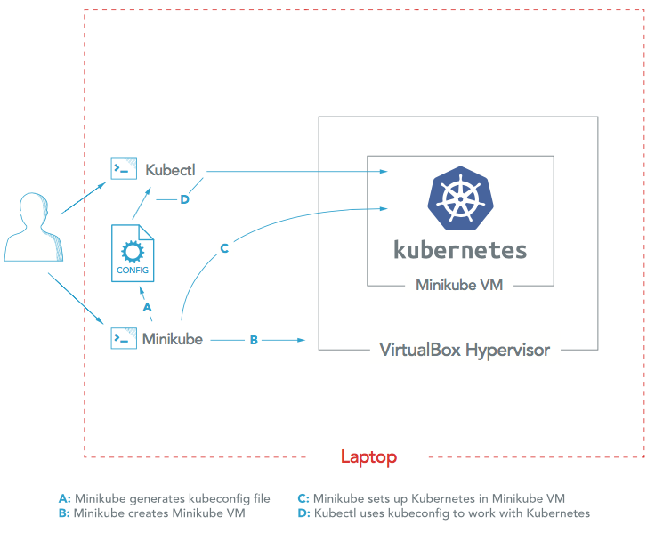
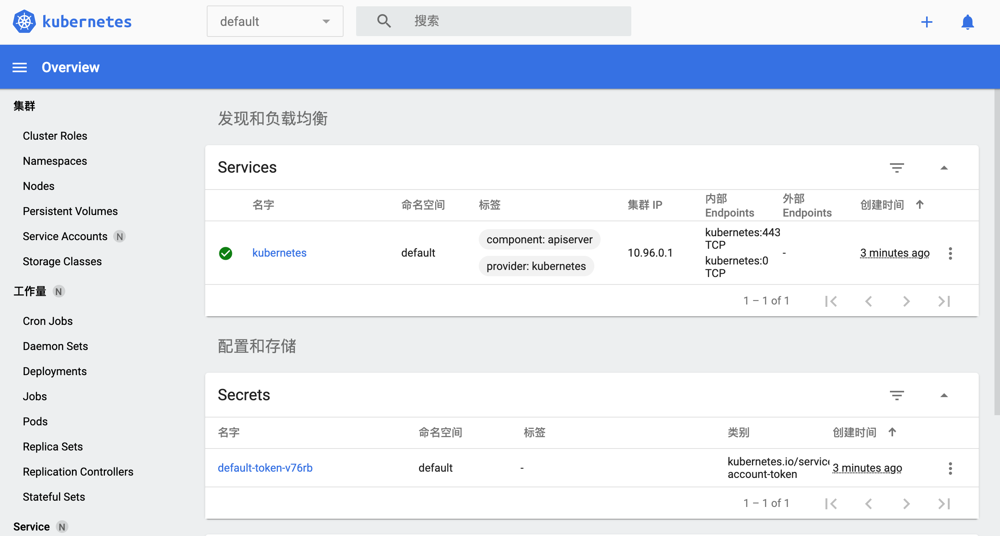
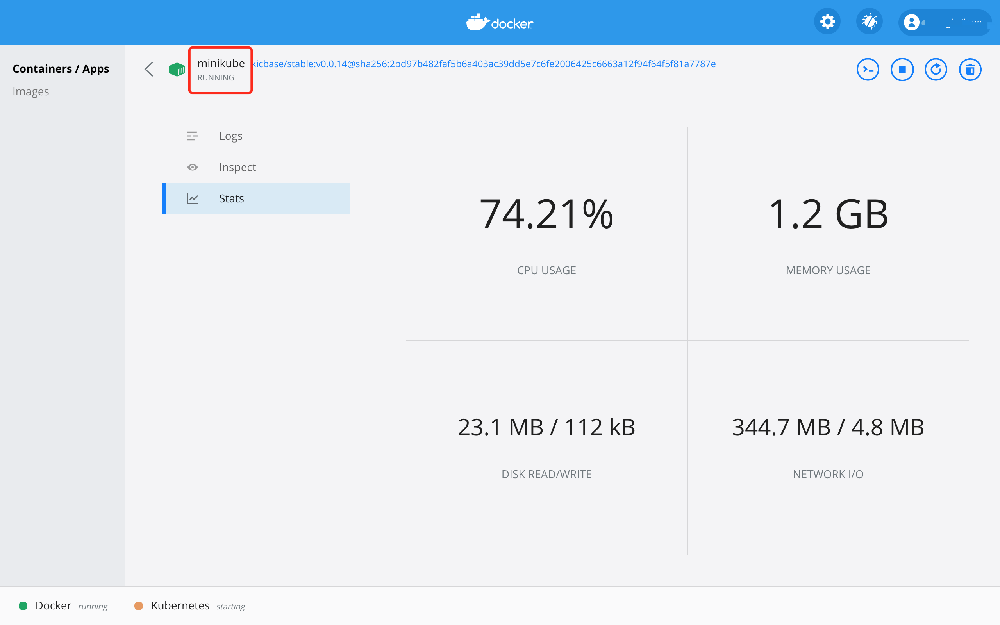

`图片来源于`[Install Kubernetes: The Ultimate Guide](https://platform9.com/docs/install-kubernetes-the-ultimate-guide/) 

## Kubernetes 简介

Kubernetes 是容器集群管理系统，是一个开源的平台，可以实现容器集群的自动化部署、自动扩缩容、维护等功能。

- 快速部署应用
- 快速扩展应用
- 无缝对接新的应用功能
- 节省资源，优化硬件资源的使用

## Minikube 简介

Minikube 可以实现一种轻量级的 Kubernetes 集群，通过在本地计算机上创建虚拟机并部署只包含单个节点的简单集群

## MacOS 系统安装依赖

### 安装依赖

```bash
# 命令行工具
brew install kubectl


brew install minikube
# 如果遇到权限文图
sudo chown -R $(whoami) /usr/local/lib/pkgconfig

## VM 驱动程序 VirtualBox
brew install docker-machine-driver-hyperkit
```

- `~/.kube/config` 文件中查看所有可用的环境

### 启动

```bash
# 可添加参数
# --vm-driver=hyperkit
minikube start

minikube dashboard
```

### Minikube Dashboard


### Docker Desktop Dashboard（MasOC）

`minikube start` 回启动一个 Docker 容器：



## 打包 Nodejs 应用镜像

### 创建 Nodejs 应用程序

创建 `hello-node` 文件夹，添加以下文件以及代码：

`server.js`

```js
var http = require('http');

var handleRequest = function(request, response) {
  console.log('Received request for URL: ' + request.url);
  response.writeHead(200);
  response.end('Hello World!');
};
var www = http.createServer(handleRequest);
www.listen(8080);

```

`Dockerfile`

```dockerfile
FROM node:10.20.0
EXPOSE 8080
COPY server.js .
CMD node server.js
```

### 打包

```bash
docker build -t hello-node:v1 .
```

生成镜像如下：

```bash
docker images
# REPOSITORY   TAG      IMAGE ID       CREATED         SIZE
# hello-node   v1       353fc3541cea   2 minutes ago   912MB
```

## 创建 Deployment

Kubernetes Pod 是一个或多个容器组合在一起得共享资源，Kubernetes Deployment 是检查 Pod的健康状况。

```bash
kubectl create deployment hello-node --image=hello-node:v1
# 输出：deployment.apps/hello-node created

# 查看 Deployment
kubectl get deployments
# NAME         READY   UP-TO-DATE   AVAILABLE   AGE
# hello-node   1/1     1            1           19s

kubectl run hello-node --image=hello-node:v1 --port=8080
# 输出：pod/hello-node created

# 查看 Pod
kubectl get pods
# NAME         READY   STATUS    RESTARTS   AGE
# hello-node   1/1     Running   0          2m56s
```

### 查看群集 events

```bash
kubectl get events
```

### 查看 kubectl 配置

```bash
kubectl config view
```

## 创建 Service

默认情况，Pod 只能通过 Kubernetes 群集内部 IP 访问。要使 hello-node 容器从 Kubernetes 虚拟网络外部访问，须要使用 Kubernetes Service 暴露 Pod。

使用 `kubectl expose` 命令将 Pod 暴露到外部环境:

```bash
kubectl expose deployment hello-node --type=LoadBalancer --port 8080
# 输出：service/hello-node exposed

kubectl get services
# NAME         TYPE           CLUSTER-IP      EXTERNAL-IP   PORT(S)          AGE
# hello-node   LoadBalancer   10.111.51.252   <pending>     8080:31869/TCP   55s
# kubernetes   ClusterIP      10.96.0.1       <none>        443/TCP          16h
```

### 浏览器访问 Service

可以通过minikube Service 命令访问。

```bash
minikube service hello-node
```

会即刻打开浏览器，显示 “Hello World” 消息。

## 更新 Nodejs 应用镜像和服务

修改 Nodejs 程序并出新镜像：

```bash
docker build -t hello-node:v2 .
```

### Deployment更新镜像

```bash
kubectl set image deployment/hello-node hello-node=hello-node:v2
```

### 更新服务

```bash
minikube service hello-node
```

## 清理

- 清理集群中的资源
  ```bash
  kubectl delete service hello-node
  kubectl delete deployment hello-node
  ```

- 服务停用

  ```bash
  minikube stop
  ```


## 遇到问题处理

1. `kubectl get nodes` 报错 `The connection to the server 127.0.0.1:55000 was refused - did you specify the right host or port?`

 解决方法：

  ```bash
  rm -rf ~/.kube

  # 重启 docker desktop

  minikube start
  ```

## 参考

- [使用 Minikube 在 Kubernetes 中运行应用](http://docs.kubernetes.org.cn/126.html)