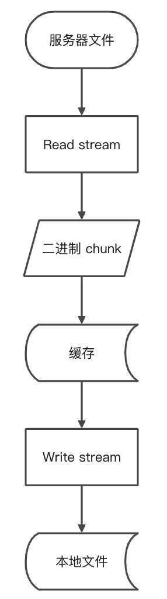

流（Stream）是 Node.js 中处理流数据的抽象接口。流模块提供用于实现流接口的 API。Node.js 中有许多流对象事例，比如：[HTTP Request](https://nodejs.org/dist/latest-v15.x/docs/api/http.html#http_class_http_incomingmessage)、[process.stdout](https://nodejs.org/dist/latest-v15.x/docs/api/process.html#process_process_stdout)

## Stream 大文件下载

node 处理大文件下载的方式是创建一个 read stream 和一个 write stream 通过管道（pipe）的形式进行文件的下载。

```js
//  fs.createReadStream(sourcePath).pipe(fs.createWriteStream(targetPath));
const fs = require('fs');
const request = require('request');

const sourcePath = 'xx/xxx.txt';
const targetPath = 'xx/xxx.txt';
const writeStream = fs.createWriteStream(targetPath)

request(sourcePath).pipe(writeStream);
```

request 方法会读入二进制片段到缓存中，然后通过 write stream 尽快写入到磁盘



流式下载可以保证不占用过大的内存，保证大文件稳定下载。但是单个下载只会占用机器小部分资源，如何充分利用机器资源优化下载呢？如果多个大文件下载，并发下载可以保证资源占用，单个大文件下载则可以指定分段下载，通过并发执行分段下载任务来充分利用资源。

## 大文件分段下载

### 下载分段文件到本地，再合并成一个大文件

通过 Range 对大文件进行分段，然后并发下载分段到本地，然后通过 Stream 将多个文件合并成一个大文件

#### 多个小文件合并成一个大文件

```js
const fs = require('fs');
const path = require('path');

function streamTogether(sourcePath, targetPath) {
  const fragmentFiles = fs.readdirSync(path.resolve(__dirname, sourcePath));
  const writeStream = fs.createWriteStream(path.resolve(__dirname, targetPath));

  streamRecursive(fragmentFiles, writeStream);
}

function streamRecursive(fFiles, wStream) {
  if (!fFiles.length) {
    return wStream.end();
  }

  const curPath = fFiles.shift();
  const curFile = path.resolve(__dirname, curPath);
  const curReadStream = fs.createReadStream(curFile);

  curReadStream.pipe(wStream, { end: false });

  curReadStream.on('end', () => {
    streamRecursive(fFiles, wStream);
  });

  curReadStream.on('error', err => {
    console.error('error:', err);
    wStream.close();
  });
}
```

## Stream 内存泄漏注意事项

默认情况读写流执行完成后，会自动关闭，不会有内存泄漏问题。但是可以通过配置设置不自动关闭。

### 手动处理 Stream 关闭

```js
readable.pipe(destination[, options])
```

options 的 end 属性：读取结束时终止写入流，默认值是 true。

设置写流为 false，在结束时手动关闭。

```js
readable.pipe(writeable, {
  end: false,
});
readable.on('end', function() {
  writeable.end('end');
});
```

如果发生异常错误，写入目标流将不会关闭，除非 kill 进程。需要监听错误异常，手动关闭写流，防止内存泄漏。

```js
readable.pipe(writeable, {
  end: false,
});
readable.on('end', function() {
  writeable.end('end');
});
readable.on('error', function() {
  console.error('error:', error);
  writeable.end('end');
});
```