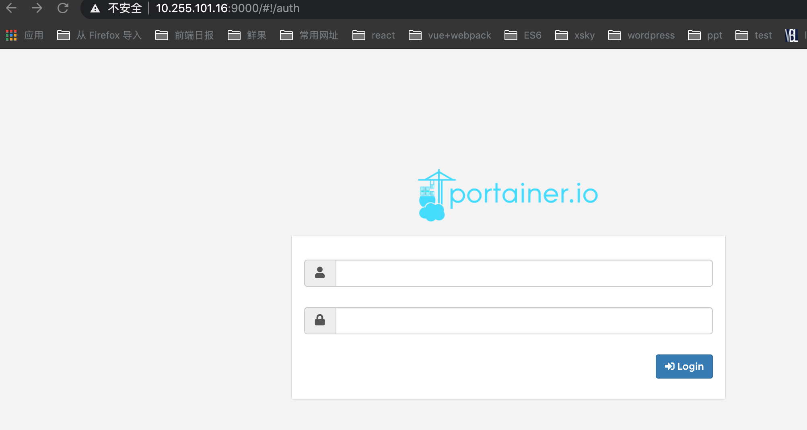
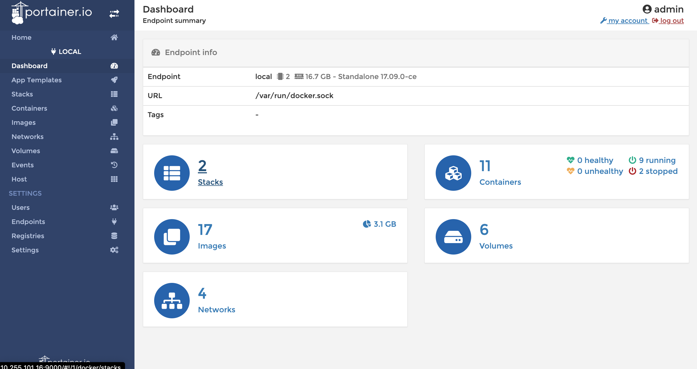

Portainer 是一个可视化的容器镜像的图形管理工具，利用 Portainer 可以轻松构建，管理和维护 Docker 环境。 而且完全免费，基于容器化的安装方式，方便高效部署。

- 监控平台：监控容器，镜像、卷、网络，事件、服务、节点等信息
- 镜像管理：查看、拉取、构建等
- 容器管理：监控查看、创建、删除、停止、日志、登录容器等
- 多用户：创建 Portainer 用户
- 定制化：更换主题和 logo

## 安装

### 安装 htpasswd 命令行

```bash
yum install httpd-tools
```

### 部署

```bash
# 如果已经安装 apache2-utils 包，直接执行命令生成加密密码
htpasswd -nb -B admin "my-password" | cut -d ":" -f 2

# 启动容器生成加密密码
docker run --rm httpd:2.4-alpine htpasswd -nbB admin "my-password" | cut -d ":" -f 2

# 启动
docker run -d -p 9000:9000 -p 8000:8000 -v /var/run/docker.sock:/var/run/docker.sock portainer/portainer-ce --admin-password='$2y$05$8oz75U8m5tI/xT4P0NbSHeE7WyRzOWKRBprfGotwDkhBOGP/u802u'
```

### 缓存密码并启动

通过 `--admin-password-file` 指定密码存放文件：

```bash
echo -n "mypassword" > /tmp/portainer_password
 docker run -d -p 9000:9000 -p 8000:8000 -v /var/run/docker.sock:/var/run/docker.sock -v /tmp/portainer_password:/tmp/portainer_password portainer/portainer-ce --admin-password-file /tmp/portainer_password
```

## Portainer 管理界面截图

### 登录页面



### 节点 Dashboard



## 参考文档

- [portainer.io](https://documentation.portainer.io/)
