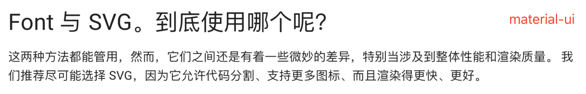
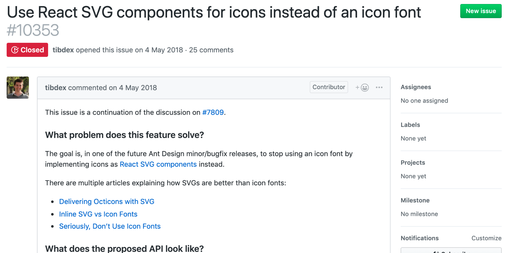

最近在关注 material-ui 和 ant-design, 发现两者都力挺使用 SVG 作为图标字体使用，调研了下，社区目前流行两种方案：Inline SVG（代码块）、Icon Font。

## 社区讨论

### [Material-ui docs](https://material-ui.com/zh/components/icons/)

### [Ant-design discuss](https://github.com/ant-design/ant-design/issues/10353)

## 两者比较
|对象 | Icon Font | Inline SVG|
|-----|-----------|-----------|
|矢量|浏览器当成常规字体，图标是反锯齿的（anti-aliased）、造成部分模糊不清|浏览器将 SVG 当成图片、并且是矢量（vector）|
|大小|1. 很小  2. 浏览器缓存|不会被浏览器缓存|
|CSS 控制|font-size, color, shadows, ...|1. 相同的 CSS 控制 2. 控制图标的各个部分 [EX](https://material-ui.com/zh/components/icons/) 3. 使用 SVG 特定 CSS|
|异常失败|1. 没有正确的 CORS 跨域问题 2. 网络慢、服务器故障导致字体文件无法加载（图标呈现方块） 3. @font-face 兼容性问题|浏览器兼容性|
|人为失败|1. 代理浏览器不支持 2. 设置禁用自定义字体 3. 强制使用自己的字体覆盖|无|
|语义|无|SVG 对浏览器提供了友好的可访问性，比如 `<title>，<desc>` 等，而且同 [WAI-ARIA](https://www.w3.org/WAI/standards-guidelines/aria/) （aria-labelledby 属性）兼容|
|处理方式|1. 只能按需补充 2. 创建图标字体很麻烦，要使用 [IcoMoon](https://icomoon.io/app/#/select)、[fontello](https://github.com/fontello/fontello)等工具|1. 随时补充、按需加载 2. 设计直接提供、稍作处理就可以使用|
|浏览器支持|IE6|IE8+、Android 2.3+|

## 参考
- [Material ui icons](https://github.com/mui-org/material-ui/tree/master/packages/material-ui-icons)
- [How to use SVG Icons as React Components?](https://www.robinwieruch.de/react-svg-icon-components/)
- [It’s 2019! Let’s End The Debate On Icon Fonts vs SVG Icons](https://www.lambdatest.com/blog/its-2019-lets-end-the-debate-on-icon-fonts-vs-svg-icons/)
- [Inline SVG vs Icon Fonts](https://css-tricks.com/icon-fonts-vs-svg/)